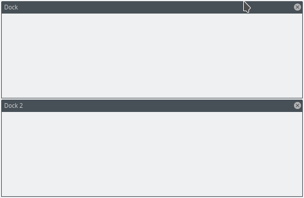
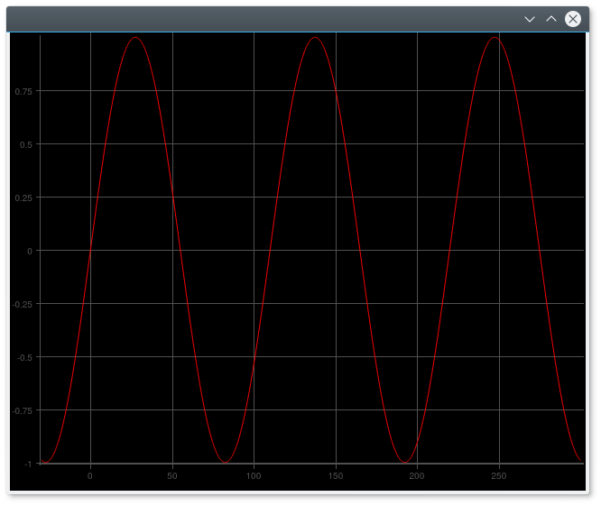

============
Introduction
============

qplotutils is a collection of custom Qt widgets to create IDE-like workbenches and chart easily.

Workbench
---------

IDE like workbenches with two docks that can be

    * rearranged (either absolute to the workbench or relative to another dock)
    * resized
    * stacked / tabbed
    * closed

by dragging the header / dock borders.

Usage is pretty easy:

.. code-block:: python

    bench = Bench()

    dock_01 = Dock()
    bench.addDock(dock_01)

    dock_02 = Dock(title="Dock 2")
    bench.addDock(dock_02)

For a full example have a look at `bench01.py <../../../examples/bench01.py>`_ module.

Line Charts
-----------

.. code-block:: python

    view = ChartView(orientation=ChartView.CARTESIAN)

    l = LineChartItem()
    x = np.arange(-30, 300, 0.2, dtype=np.float)
    y = np.sin(2 * np.pi * 3 / float(max(x) - min(x)) * x)
    l.plot(y, x, "a sine")

    view.addItem(l)

For a full example have a look at `chart01.py <../../../examples/chart01.py>`_ module.
